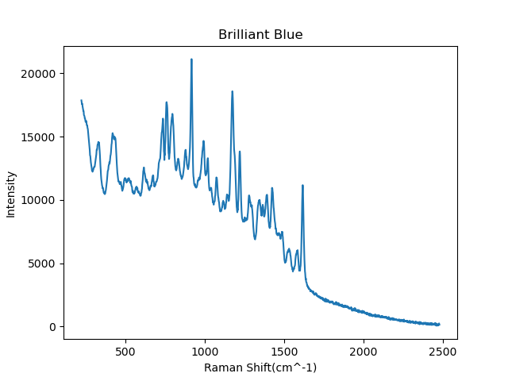

# WGAN-GP-for-Raman-Spectra
## Introduction
This repo contains the pytorch implementations of several types of GANs for 1-D signal. It was used to generate fake data of Raman spectra, which are typically used in Chemometrics as the fingerprints of materials.

If you use these code, please kindly cite the  this repository.

## Requirements

## Reference

[1] Nathan Inkawhich. DCGAN Tutorial [EB/OL]. https://pytorch.org/tutorials/beginner/dcgan_faces_tutorial.html, 2020-10-15.

